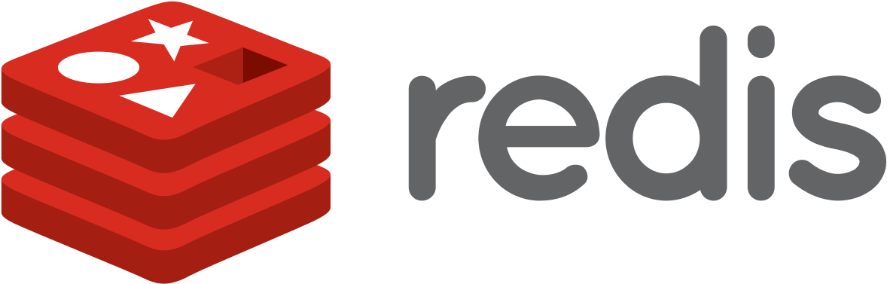

<h1 align="center">  Person Microservice </hi>

## 🚀 Getting Start


This microservice was created with the purpose of having a module, in Node js, for creating and maintaining the registration of a system. Below you will get information on what technology was used, how to run the application, among other information

## 👨‍💻 Technology
<a href="https://adonisjs.com/">
    
</a>
<a href="https://github.com/adonisjs/adonis-persona">
    
</a>
<a href="https://github.com/Rocketseat/adonis-bull">
    
</a>
<a href="https://redis.io/">
    
</a>
<a href="https://docker.com/">
    
</a>

## ⛹️‍♂️ Run aplication

The application runs on the door `3333`. If you need to change, change directly in the env

1. Go to the root of the project and run the docker:

```bash
docker-compose up -d
```

2. To start Adonis js you must run

```bash
adonis key:generate

adonis server --dev
```

3. Migration run:

```bash
adonis migration:run
```

## 🛤 Routes

`(POST)` /user => Create user</br>
`(POST)` /user/verifyEmail => Validates the email using the token</br>
`(POST)` /user/session => Creates the user session

## 🔐 Inter-service authentication

Get the APP_KEY in the .env and pass the request header. Imagine i have this app key `1f9d0DA209fas` 
so I will declare as follows:

```bash
curl --request POST \
  --url .../user \
  --header 'app-key: 1f9d0DA209fas`' \
  --data '{
      ...
  }'
```

Ready requests will only work if the other micro service has the app_key.